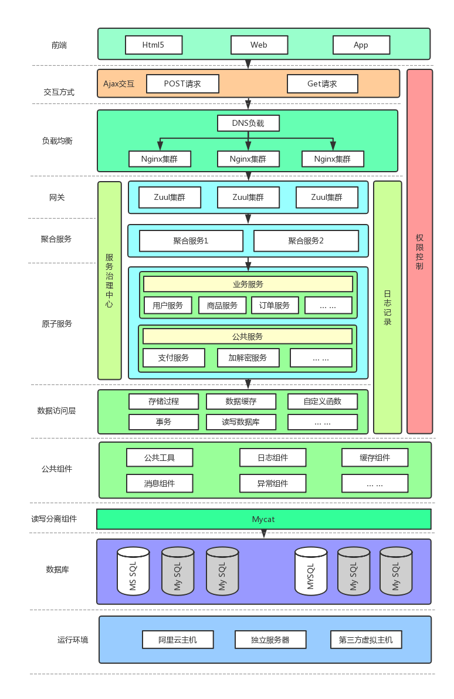
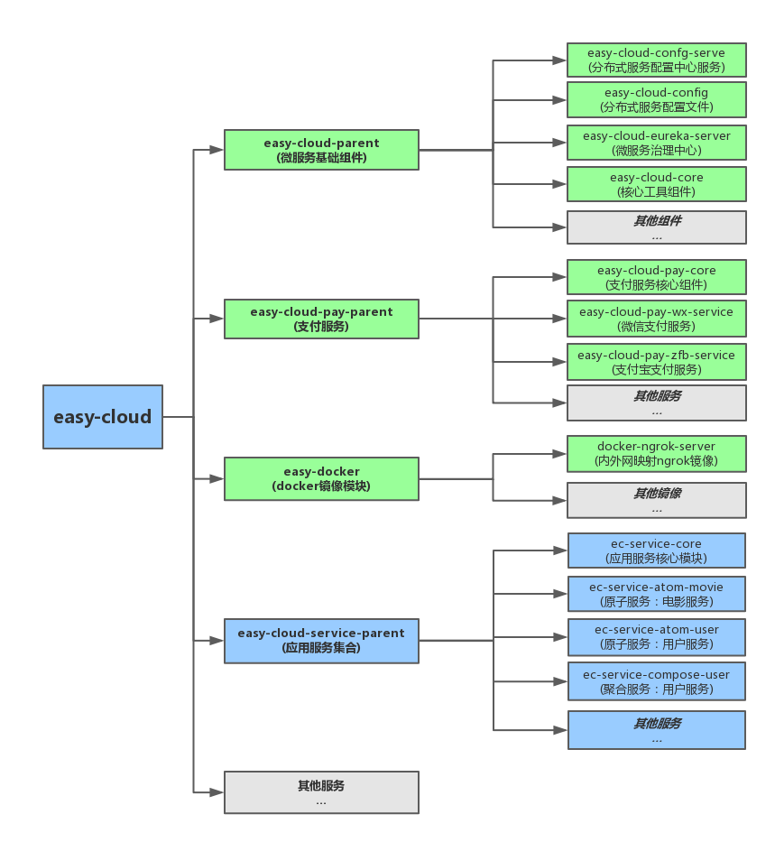

# easy-cloud简称EasyCloud
## 前言
### 宗旨：EasyCloud,EasyCode

###    说明

- 享受各种开源组件带来的便利和惠泽。怀着无比感恩之心为开源尽一份微薄之力。
- dqEasyCloud以spring-boot和spring-cloud为基础，同时定义一套微服务的相关规范，尽可能的降低企业维护成本。
- 如您觉得该项目对您有用，欢迎点击右上方的Star按钮，给予支持！！欢迎大家一起参与开发
- 由于我们经验见识有限，尽管殚精竭虑依旧有很多不足之处，非常期待接受您的意见和建议。欢迎大家加入easy-cloud开源项目组。

###     使用申明
- 为方便开发者初步使用、项目提供了可直接运行的环境资源
- 本开源项目所有可运行的资源包括但不限于(数据库资源、缓存资源、消息队列资源等等)，只可以用做测试之用。切勿进行压力测试
- 若要进行压力测试，请替换为自己的数据资源

## 项目基础架构
###  请求流程解析

- 前端请求->dns负载->nginx反向代理集群->zuul网关集群->聚合服务层->原子服务层->数据层访问层。

### 系统架构图

### 项目结构图

###  项目编码规范解析

- EasyCloud推荐封装自己的工具类，业务逻辑类尽可能降低与第三方接口的依赖，从而方便统一管理及维护。

- EasyCloud相关工具类都以Ec作为前缀开头:目的是为了防止和第三方的工具类同名冲突。

- EasyCloud原子服务层使用了模块化思想进行封装，分为工具模块和业务逻辑模块。

## 开发步骤
###     集成微服务基本组件

###     项目实战(用户关注电影功能)

## 持续开发中
